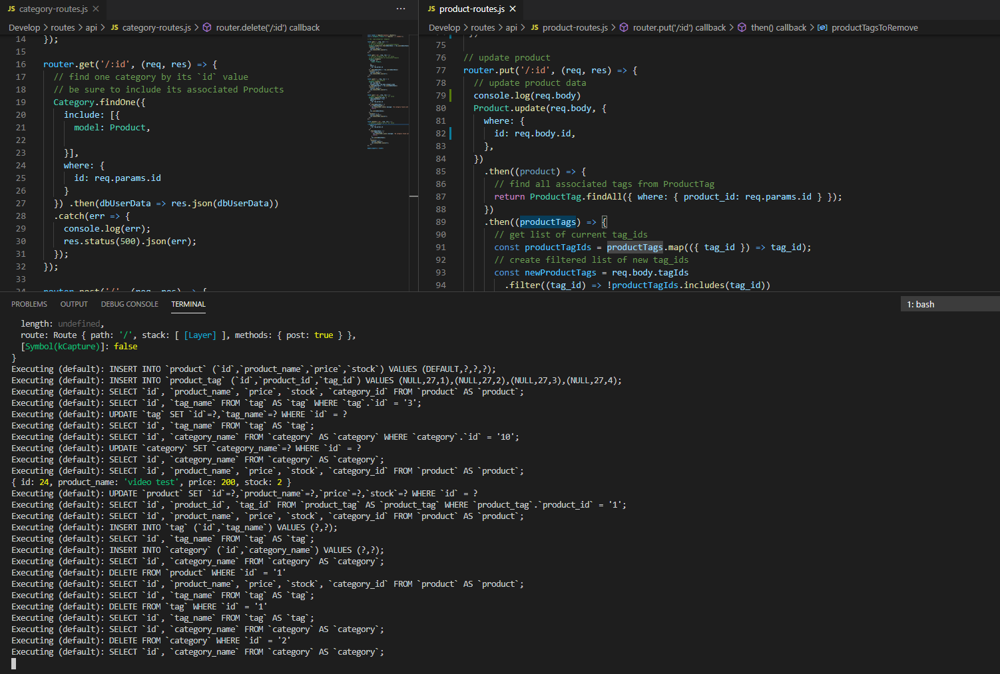
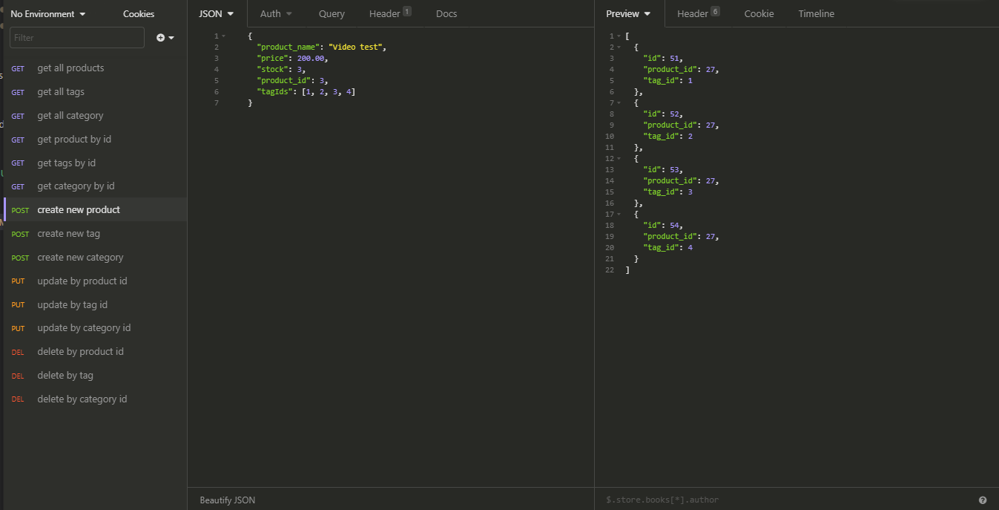

<h1 align="center">E-Commerce Back End</h1>

  

## Table of Contents
- [Description](#description)
- [Installation](#install)
- [Usage](#usage)
- [Questions](#questions)

## Description
### This application uses MySql2, nodemon, sequelize, dotenv, and express to create the backend of a shopping site. All SQL injections are run in JS and the tables connect via their primary keys so you can find any of the tables data through any other making a streamlined user experience. The code is modularized to make expansion and general reading of the code base simpler. 

### Screenshot of the VSCode console injecting the SQL commands via the JS models.

### Screenshot of the program Insomnia, used to test the routes and tables.

## Usage
## Youtube Video running through all the routes and SQL injections.

## Install
npm init  --> npm install mysql2 sequelize dotenv
npm run seeds to fill the tables with dummy data
npm install nodemon "if you want an easier time testing while changing routes"

## Questions
## Contact me at:
### [JCSRyan](https://github.com/jcsryan)
### JohnConnorSRyan@gmail.com